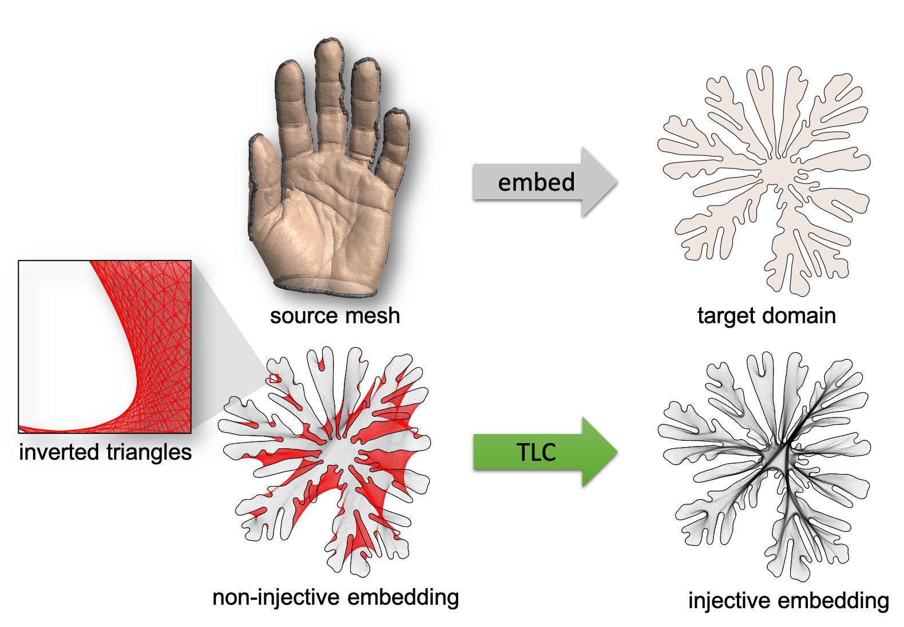

# TLC-PN

[`Project Page`](https://duxingyi-charles.github.io/publication/lifting-simplices-to-find-injectivity/)
[`Dataset`](https://github.com/duxingyi-charles/Locally-Injective-Mappings-Benchmark)

TLC-PN computes locally injective mappings from a source mesh to a
user-specified target domain. The program recovers an injective mapping from a non-injective
initial embedding by minimizing the TLC (Total Lifted Content) energy proposed in our paper
[Lifting Simplices to Find Injectivity](https://duxingyi-charles.github.io/publication/lifting-simplices-to-find-injectivity/).

In TLC-PN, the TLC energy is minimized by projected Newton (PN) method.

There is a similar program [TLC-QN](https://github.com/duxingyi-charles/lifting_simplices_to_find_injectivity)
 based on quasi-Newton method.

## Build

Tested on macOS 10.15.5 (Apple Clang 11.0.3), Windows 10 (visual studio 2019).

Requirements: Eigen, SuiteSparse, OpenMP (follow instructions below to install and build).

### Mac

The easiest way to build on Mac is to run the script, which installs Eigen, SuiteSparse, openMP library using [homebrew](https://brew.sh/) and compiles the program.

    ./build_mac.sh

The program `findInjective_PN` will be generated in the `build` subdirectory.

### Windows

_Eigen_ (version 3.3.7): download source code from [official site](http://eigen.tuxfamily.org/index.php?title=Main_Page).

_SuiteSparse_: follow the instructions on [suitesparse-metis-for-windows](https://github.com/jlblancoc/suitesparse-metis-for-windows) to install SuiteSparse.

Now, to build our program, you can use CMake to generate a visual studio project with the provided `CMakeLists.txt`.

You may need to change "EIGEN_INCLUDE_DIR", "SUITESPARSE_INCLUDE_DIR" and "SuiteSparse_DIR" to the proper paths on your machine.

## How to use

The executable `findInjective_PN` asks for 3 arguments: path to an input data file, path to a solver options file, and path to the file to store the result.

    ./findInjective_PN [input_file] [solver_options_file] [result_file]

An example is provided in the `example` subdirectory. Test it by:

    ./findInjective_PN example/input example/solver_options example/my_result

The result will be written to `example/my_result`.

In the 3 arguments, `input_file` is mandatory, while the rest two are optional. If `solver_options_file` is not specified, `findInjective` will look for a file named `solver_options` in the same directory as the binary. If that file is not found, the program will fall back to default options. If `result_file` is not given, results will be written to a file named `result` in the directory of the binary.

## File format

### input_file

_Input file_ contains vertices and faces(triangles/tetrahedrons) information about the source mesh and initial embedding, as well as the indices of constrained vertices (usually boundary vertices).

    [num_sourceVert] [dimension_sourceVert]
    ... (num_sourceVert * dimension_sourceVert) Matrix ...
    [num_initVert]   [dimension_initVert]
    ... (num_initVert * dimension_initVert) Matrix ...
    [num_simplex]    [simplex_size]
    ... (num_simplex * simplex_size) Matrix ...
    [num_handles]
    ... (num_handles * 1) Matrix ...
 
 See `example/input` for a concrete example.
 
 **It's possible to use your own mesh formats.** See [here](https://github.com/duxingyi-charles/lifting_simplices_to_find_injectivity#input_file) for the instructions. 
 
### solver_options_file

_Solver options file_ contains parameters for TLC energy, options for optimization, and a list of intermediate status to record during optimization.

    form
    [harmonic OR Tutte]
    alphaRatio
    [val]
    alpha
    [val]
    ftol_abs
    [val]
    ftol_rel
    [val]
    xtol_abs
    [val]
    xtol_rel
    [val]
    gtol_abs
    [val]
    algorithm
    [Projected_Newton]
    maxeval
    [val]
    stopCode
    [none OR all_good]
    record
    vert            [0 OR 1]
    energy          [0 OR 1]
    minArea         [0 OR 1]
    gradient 		[0 OR 1]
    gNorm 			[0 OR 1]
    searchDirection [0 OR 1]
    searchNorm		[0 OR 1]
    stepSize		[0 OR 1]
    stepNorm		[0 OR 1]
    save
    vert			[0 OR 1]
 
 |                        | possible values  | default value    | explanation                                                                                                                    |
 |------------------------|------------------|------------------|--------------------------------------------------------------------------------------------------------------------------------|
 | form                   | harmonic, Tutte  | Tutte            | two forms of TLC energy (see paper for details)                                                                                |
 | alphaRatio             | [0, inf)         | 1e-6             | Specify the ratio of content (area or volume) between rest mesh and target domain. Default value 1e-6 is recommended.          |
 | alpha                  | (-inf, inf)      | 1e-6             | If negative, alpha will be computed from alphaRatio. If non-negative, alpha will overwrite the value computed from alphaRatio. |
 | ftol_abs               | (-inf, inf)      | 1e-8             | Absolute energy change stop threshold. Negative value means disabled.                                                          |
 | ftol_rel               | (-inf, inf)      | 1e-8             | Relative energy change stop threshold. Negative value means disabled.                                                          |
 | xtol_abs               | (-inf, inf)      | 1e-8             | Absolute variable change stop threshold. Negative value means disabled.                                                        |
 | xtol_rel               | (-inf, inf)      | 1e-8             | Relative variable change stop threshold. Negative value means disabled.                                                        |
 | gtol_abs               | (-inf, inf)      | 1e-8             | Gradient norm stop thereshold. Negative value means disabled.                                                                  |
 | algorithm              | Projected_Newton | Projected_Newton | Projected Newton method.                                                                                                       |
 | maxeval                | positive integer | 1000             | max number of iteration stop threshold.                                                                                        |
 | stopCode               | none, all_good   | all_good         | Custom stop criteria. "all_good": optimization will stop when there is no inverted elements.                                   |
 | record:vert            | 0, 1             | 0                | 1: record target mesh vertices at each iteration.                                                                              |
 | record:energy          | 0, 1             | 0                | 1: record TLC energy at each iteration.                                                                                        |
 | record:minArea         | 0, 1             | 0                | 1: record smallest simplex signed content (area or volume) at each iteration.                                                  |
 | record:gradient        | 0, 1             | 0                | 1: record gradient vector at each iteration.                                                                                   |
 | record:gNorm           | 0, 1             | 0                | 1: record gradient norm at each iteration.                                                                                     |
 | record:searchDirection | 0, 1             | 0                | 1: record searchDirection at each iteration.                                                                                   |
 | record:stepSize        | 0, 1             | 0                | 1: record line search step size taken at each iteration.                                                                       |
 | record:stepNorm        | 0, 1             | 0                | 1: record norm of (xnext-x) at each iteration.                                                                                |
 | save:vert              | 0, 1             | 0                | 1: At each iteration, save target mesh vertices at the current iteration to a separate file.                                   |
   
   See `example\solver_options` for a concrete example.

### result_file

_Result file_ stores the vertices of result mesh, and also intermediate records as specified in solver options file.

    
    name dims
    data
    ...

See `example\result` for a concrete example.

We provide a script to convert a `result_file` to a mesh file. See [here](https://github.com/duxingyi-charles/lifting_simplices_to_find_injectivity#result_file).

